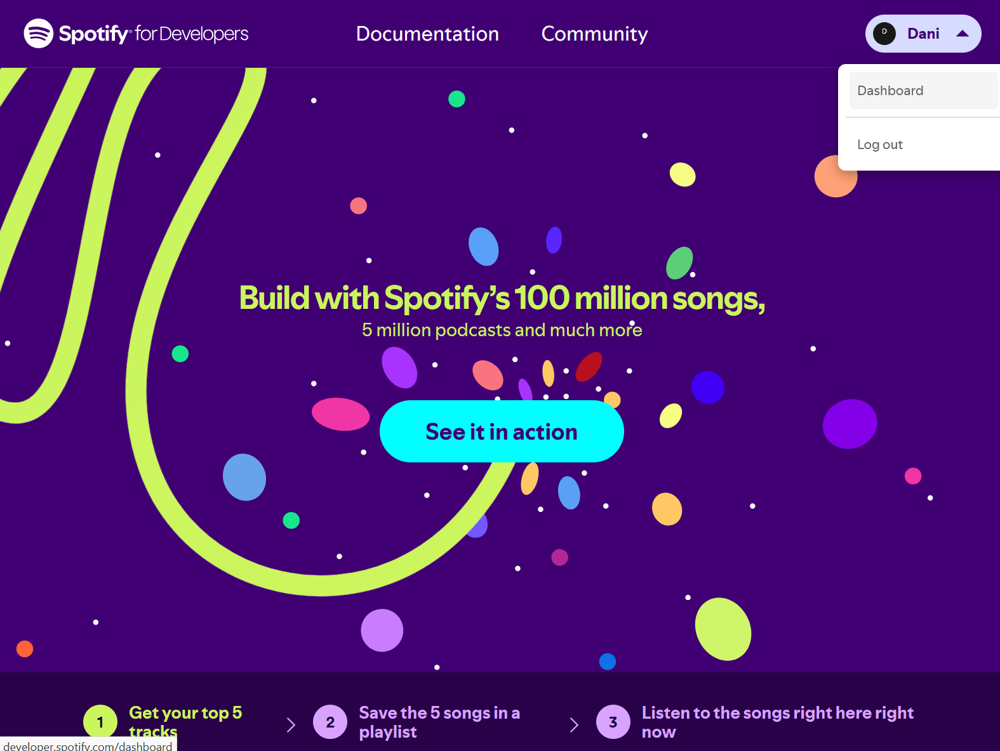

# Spotify App creation guide

** Note: You need Spotify Premium to use the package **

The Spotify package for the Grid Editor:tm: framework supports controlling the playback state of the Spotify Player and add or remove the currently playing song to a playlist. Unfortunately, Spotify haven't granted us a production application to use their API yet, so every user has to create their own developer app to access Spotify. This guide helps you through the steps.

1.  **Sign in to the Spotify Developer Platform**

    After pressing the "Spotify Developer Login" button in the Preferences window, the Spotify Developer site should open in a new window. You will be required to sign in with your normal Spotify Account.
    If you want to do this in your browser instead, you can [use the following link as well](https://developer.spotify.com/).
    

2.  **Create the Spotify Application**

    After logging in, open the developer dashboard found under your profile menu.
    
    Then select "Create app".

3.  **Fill in the application details**

    You can set the App name and description to whatever string you want. Set the **Redirect URIs** to `http://127.0.0.1:3845/callback`.
    Select the Web API to use and agree to the Spotify terms.
    

4.  **Copy to Client ID into the Spotify Preference panel**

    The Client ID identifies the created Spotify App to the Spotify servers. By default, only the account that created the application can use the Spotify API.
    

5.  **Authorize the Package**

    If everything is set up correctly, pressing the "Authorize" button in the package preference page should open a spotify authorization web page. After confirming the connection to the Spotify App, the Editor should show that the connection is ready.

6.  **Use the Package**

    Congratulations, you have successfully registered and authorized the connection between Grid Editor and Spotify! You are now able to use the Spotify Actions on the Grid Module!
